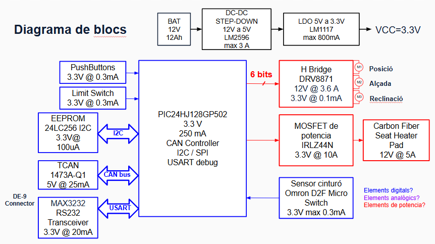

View this project on [CADLAB.io](https://cadlab.io/project/30193). 

# Projecte Seients

>**Autors: MIGUEL Angel Tovar Jaime - Pol Salas Costa** 
>**Versió: 1.0.0**

----------

## Objectiu

>Dissenyar una Unitat de Control Electrònic (ECU) per al control dels seients, capaç de gestionar la posició, memòria de la posició i l'escalfador del seient, comunicant-se amb la resta del vehicle mitjançant bus CAN.

## Diagrama de blocs

### Descripció/funcionalitat de cada bloc

  * **Processament Lògic:** Microcontrolador PIC24HJ128GP502 a 3.3V encarregat de l'execució del firmware i gestió de perifèrics
  * **Alimentació:** Sistema de doble regulació. Un convertidor LM2596 que redueix els 12V de la bateria a 5V per a comunicacions, i un regulador LM1117 que  proporciona 3.3V nets per a la lògica digital
  * **Control de Potència:** Controlador PWM actuant a través del bus I2C, PCA9685, per accionar els drivers dels 3 motors (posició, altura, reclinació). S'inclou un MOSFET per al control de la manta calefactora
  * **Emmagatzematge:** Memòria EEPROM I2C, 24LC256, per desar de forma no volàtil certes posicions dels seients
  * **Interfícies de Comunicació:** Transceptor TCAN1043 per a connexió al bus CAN del vehicle, i MAX3232 per adaptar els nivells lògics UART a RS232 per a depuració mitjançant connector DE-9
  * **Entrades/Sensors:** Connectors per a la botonera d'usuari i finals de cursa

-----------

## Requisits / Especificacions

  * Alimentació d'entrada: 12V DC
  * Tensions de regulació interna: 5V DC i 3.3V DC
  * Microcontrolador: PIC24HJ128GP502
  * Freqüència de rellotge: Cristall extern de 8 MHz
  * Entrades digitals: 6 botons de control de seient i 3 finals de cursa agrupats
  * Comunicacions: Bus CAN, bus I2C, i port sèrie UART/RS232

-----------

## Components

| Descripci&#243; | Ref | Package |Datasheet | Prove&#239;dor | Preu | Unitats |
| --- | --- | --- | --- | ---| --- | --- |
| Microcontrolador | PIC18F26Q83-I/SS | SOIC-28 |[Datasheet](https://www.mouser.es/datasheet/2/268/PIC18F27_47_57Q83_Preliminary_Data_Sheet_40002265B-2887591.pdf) | [Mouser](https://www.mouser.es/c/?q=PIC18F27Q83-I%2FSO)| 2,17&euro;| 1x |
| XTAL-Ressonador | CSTCR7M99G53-R0 | SMD |[Datasheet](https://www.mouser.es/datasheet/2/281/p16e-522700.pdf) | [Mouser](https://www.mouser.es/ProductDetail/Murata-Electronics/CSTCR7M99G53-R0?qs=Zd9RUO93%2Fo7cnwzsujIkpA%3D%3D)  | 0,27&euro; | 1x |

-----------

## Software

### Eines:

  * KiCad 9.0 o superior
  * 

### Configuraci&#243; :

  * 

### Funcionalitats:

  * 

-----------

## Historial de canvis

| Data | Autor     | Branch | Versi&#243; | Descripci&#243; |
| --- | --- | --- | --- | --- |
|  28/03/2023 | mlopez | Master | initial commit | Primera versi&#243; d'esquem&#224;tic i selecci&#243; de components |
| --- | --- | --- | --- | --- |
| 17/03/2026 | Pol i Miguel | main | 1.0.0 | Finalització de l'esquemàtic, disseny jeràrquic i afegides xarxes de protecció EMI/RC. |
